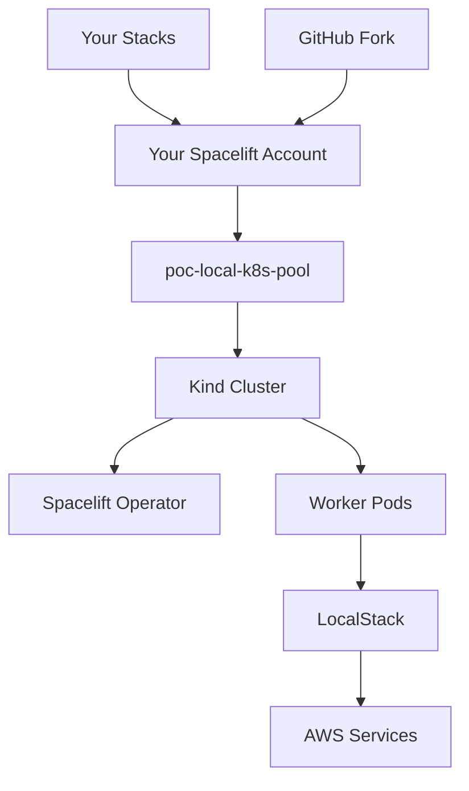

# Spacelift POC "Easy Button" 🚀

> **Complete Spacelift environment in 5-7 minutes with zero cloud dependencies**

This repository provides a complete Spacelift Proof-of-Concept environment that runs locally using LocalStack (AWS simulation) and Kubernetes. Perfect for prospects, demos, and testing Spacelift features without requiring any cloud accounts.

## 🎯 What You Get

**Single Command Setup** (`./setup.sh`) provides:
- ✅ **LocalStack** - Full AWS services locally (S3, Lambda, DynamoDB, EC2, etc.)
- ✅ **Kubernetes Cluster** - Kind cluster with Spacelift operator
- ✅ **Spacelift Worker Pool** - Connected to your Spacelift account
- ✅ **Ready-to-Use Stacks** - Sample infrastructure targeting LocalStack
- ✅ **Complete Integration** - AWS credentials, contexts, and governance

**Time to working environment: 5-7 minutes** ⏱️

## 🔧 Prerequisites

Before starting, ensure you have these tools installed:

| Tool                                                              | Purpose | Installation |
|-------------------------------------------------------------------|---------|-------------|
| [Docker Desktop](https://www.docker.com/products/docker-desktop/) | Container runtime | Download from official site |
| [Kind](https://kind.sigs.k8s.io/docs/user/quick-start/)           | Kubernetes in Docker | `brew install kind` (macOS) |
| [kubectl](https://kubernetes.io/docs/tasks/tools/)                | Kubernetes CLI | `brew install kubectl` (macOS) |
| [Helm](https://helm.sh/docs/intro/install/)                       | Kubernetes package manager | `brew install helm` (macOS) |
| [OpenTofu](https://opentofu.org/docs/intro/install/)              | Infrastructure as Code | `brew install opentofu` (macOS) |
| [SpaceCTL](https://docs.spacelift.io/concepts/spacectl)           | Spacelift management | `brew install spacelift-io/spacelift/spacectl` (macOS) |

> **Note**: The setup script will validate all prerequisites and provide installation guidance for missing tools.

## 🚨 IMPORTANT: Fork This Repository

**You MUST fork this repository to your GitHub account before proceeding.**

Why? Spacelift integrates with GitHub to manage your infrastructure stacks. When you create stacks in Spacelift, it will look for the repository under your GitHub profile. Using the original repository will cause stack creation to fail.

### Steps:
1. **Fork this repository** using GitHub's fork button
2. **Clone YOUR fork** (not the original):
   ```bash
   git clone https://github.com/YOUR-USERNAME/POC.git
   cd POC
   ```
3. Continue with setup below

## 🚀 Quick Start

### 1. Clone Your Fork
```bash
git clone https://github.com/YOUR-USERNAME/POC.git
cd POC
```

### 2. Run Complete Setup
```bash
./setup.sh
```

This single command will:
1. ✅ Validate all prerequisites
2. ✅ Start LocalStack (AWS services)
3. ✅ Create Kind Kubernetes cluster
4. ✅ Install Spacelift operator
5. ✅ Authenticate with your Spacelift account (browser login)
6. ✅ Create worker pool, context, and space in Spacelift
7. ✅ Deploy local workers connected to your account

### 3. Verify Setup
```bash
# Check LocalStack services
curl http://localhost:4566/_localstack/health

# Check Kubernetes cluster
kubectl get nodes --context kind-spacelift-poc

# Check Spacelift workers
kubectl get pods -n spacelift-worker-controller-system --context kind-spacelift-poc
```

## 📋 What Gets Created

### LocalStack (AWS Simulation)
- **Endpoint**: http://localhost:4566
- **Credentials**: `AWS_ACCESS_KEY_ID=test`, `AWS_SECRET_ACCESS_KEY=test`
- **Region**: us-east-1
- **Services**: S3, Lambda, DynamoDB, API Gateway, EC2, VPC, IAM, CloudFormation, RDS, STS

### Kubernetes Environment
- **Cluster**: `spacelift-poc` (Kind cluster)
- **Context**: `kind-spacelift-poc`
- **Namespace**: `spacelift-worker-controller-system`
- **Ports**: 8080 (HTTP), 8443 (HTTPS), 8000 (custom)

### Spacelift Resources
- **Worker Pool**: `poc-local-k8s-pool`
- **Space**: "POC Environment" 
- **Context**: "localstack-aws-credentials" (pre-configured)
- **Integration**: Full AWS credentials and endpoints configured

## 🏗️ Using Your Environment

### Create Your First Stack

1. **Log into Spacelift** (your account used during setup)
2. **Create a new stack**:
   - **Repository**: Your forked repository (`YOUR-USERNAME/POC`)
   - **Branch**: `main`
   - **Project root**: `stacks/s3-bucket` (sample provided)
   - **Worker Pool**: Select `poc-local-k8s-pool`
   - **Space**: Select "POC Environment"

3. **Attach the LocalStack context**:
   - Go to stack settings → Contexts
   - Attach "localstack-aws-credentials"

4. **Run the stack** - it will deploy to LocalStack!

### Sample Stacks Included

The repository includes sample infrastructure in `stacks/`:

```
stacks/
└── s3-bucket/          # Simple S3 bucket with policies
    ├── main.tf         # S3 bucket configuration
    ├── variables.tf    # Input variables
    └── outputs.tf      # Stack outputs
```

### Testing AWS Integration

Your stacks will deploy to LocalStack instead of real AWS:

```bash
# List S3 buckets created by your stacks
aws --endpoint-url=http://localhost:4566 s3 ls

# View DynamoDB tables
aws --endpoint-url=http://localhost:4566 dynamodb list-tables

# Check Lambda functions
aws --endpoint-url=http://localhost:4566 lambda list-functions
```

## 🔍 Validation & Monitoring

### Environment Status
```bash
# Overall environment status (re-run setup if needed)
./setup.sh

# LocalStack health
docker-compose ps
docker-compose logs localstack

# Kubernetes cluster
kubectl get nodes --context kind-spacelift-poc
kubectl get pods --all-namespaces --context kind-spacelift-poc

# Spacelift operator
kubectl get pods -n spacelift-worker-controller-system --context kind-spacelift-poc
```

### Worker Pool Health
```bash
# Check worker pods
kubectl get pods -n spacelift-worker-controller-system --context kind-spacelift-poc -l app.kubernetes.io/name=spacelift-worker

# View worker logs
kubectl logs -n spacelift-worker-controller-system --context kind-spacelift-poc -l app.kubernetes.io/name=spacelift-worker

# Check WorkerPool resource
kubectl get workerpool -n spacelift-worker-controller-system --context kind-spacelift-poc
```

### Spacelift Integration
```bash
# List your stacks
spacectl stack list

# Check worker pool status in Spacelift
spacectl worker-pool list
```

## 🧹 Cleanup

### Complete Environment Cleanup
```bash
./cleanup.sh
```

This will:
- Stop and remove LocalStack containers
- Delete Kind cluster
- Remove generated certificates (optional)
- Clean up Docker resources

### Partial Cleanup Options
```bash
# Stop only LocalStack
docker-compose down

# Delete only Kind cluster
kind delete cluster --name spacelift-poc

# Remove certificates (if needed)
rm -rf certs/
```

## 🚨 Troubleshooting

### Common Issues

**Setup fails with "Docker daemon not running"**
```bash
# Start Docker Desktop and verify
docker ps
```

**LocalStack services not healthy**
```bash
# Check LocalStack logs
docker-compose logs localstack

# Restart LocalStack
docker-compose down && docker-compose up -d
```

**Kind cluster creation fails**
```bash
# Delete existing cluster and retry
kind delete cluster --name spacelift-poc
./setup.sh
```

**Spacelift authentication fails**
```bash
# Re-authenticate with spacectl
spacectl profile login

# Verify authentication
spacectl whoami
```

**Worker pool not connecting**
```bash
# Check worker pod logs
kubectl logs -n spacelift-worker-controller-system --context kind-spacelift-poc -l app.kubernetes.io/name=spacelift-worker

# Verify certificates
ls -la certs/

# Recreate worker pool
./scripts/setup-complete-workerpool.sh
```

### Getting Help

**Check Prerequisites**
```bash
# The setup script validates all tools
./setup.sh
```

**Environment Validation**
```bash
# Test LocalStack
curl http://localhost:4566/_localstack/health

# Test Kubernetes
kubectl cluster-info --context kind-spacelift-poc

# Test Spacelift CLI
spacectl whoami
```

**Log Collection**
```bash
# LocalStack logs
docker-compose logs localstack > localstack.log

# Worker logs
kubectl logs -n spacelift-worker-controller-system --context kind-spacelift-poc -l app.kubernetes.io/name=spacelift-worker > worker.log

# Operator logs
kubectl logs -n spacelift-worker-controller-system --context kind-spacelift-poc -l app.kubernetes.io/name=spacelift-workerpool-controller > operator.log
```

## 📚 Architecture Details

### Components



### Data Flow
1. **Stack Creation**: Stacks created in Spacelift reference your forked repository
2. **Worker Assignment**: Stacks use `poc-local-k8s-pool` for execution
3. **Local Execution**: Worker pods in Kind cluster execute Terraform
4. **AWS Simulation**: Resources created in LocalStack instead of real AWS
5. **Result Reporting**: Results reported back to Spacelift

### Security
- 🔒 All certificates auto-generated and kept local
- 🔒 No cloud credentials required
- 🔒 LocalStack isolated to localhost
- 🔒 Kubernetes cluster isolated to Docker network
- 🔒 Spacelift authentication via secure browser flow

## 🎯 Use Cases

### Sales Demos
- Complete Spacelift workflow in minutes
- No cloud costs or complexity
- Showcase governance, policies, and blueprints
- Reset environment between demos

### Customer POCs
- Hands-on Spacelift experience
- Test real infrastructure patterns
- Evaluate governance features
- Risk-free experimentation

### Training & Learning
- Safe environment to learn Spacelift
- Practice with Terraform and Kubernetes
- Understand operator patterns
- Test different configurations

## 🔮 Next Steps

### Expanding Your POC

1. **Add More Stacks**: Create additional infrastructure in `stacks/`
2. **Test Policies**: Add OPA policies for governance
3. **Try Blueprints**: Create self-service templates
4. **Explore Integrations**: Test webhooks, notifications, and APIs

### Advanced Configuration

- **Custom Worker Images**: Modify worker configuration
- **Additional AWS Services**: Enable more LocalStack services
- **Network Policies**: Add Kubernetes security
- **Monitoring**: Add observability tools

## 📄 License

This project is licensed under the MIT License - see the [LICENSE](LICENSE) file for details.

---

**Need Help?** This environment is designed to "just work" - if you encounter issues, the most common solution is re-running `./setup.sh` as it's fully idempotent. For persistent issues, check the troubleshooting section above.

**Ready to go live?** Contact Spacelift to discuss production deployment options and enterprise features.